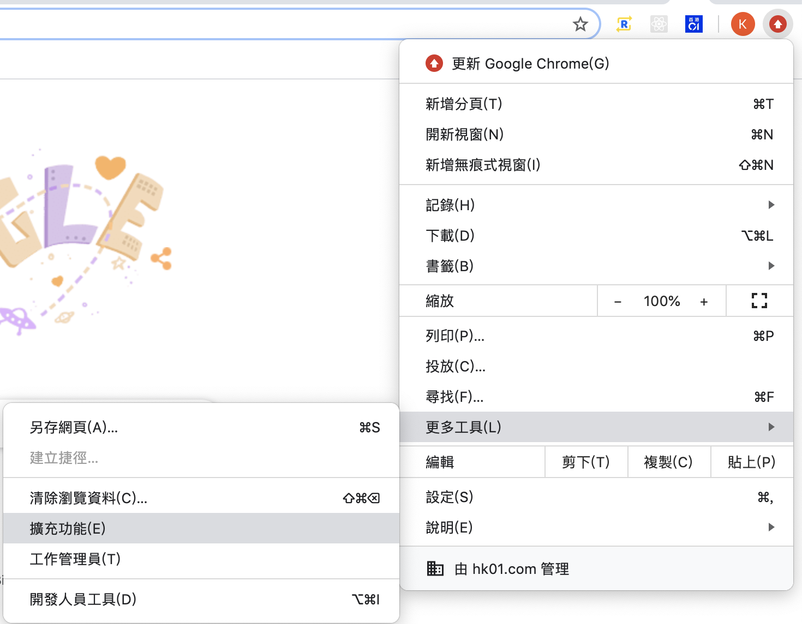
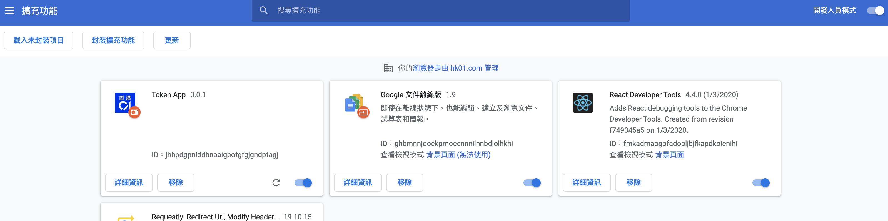
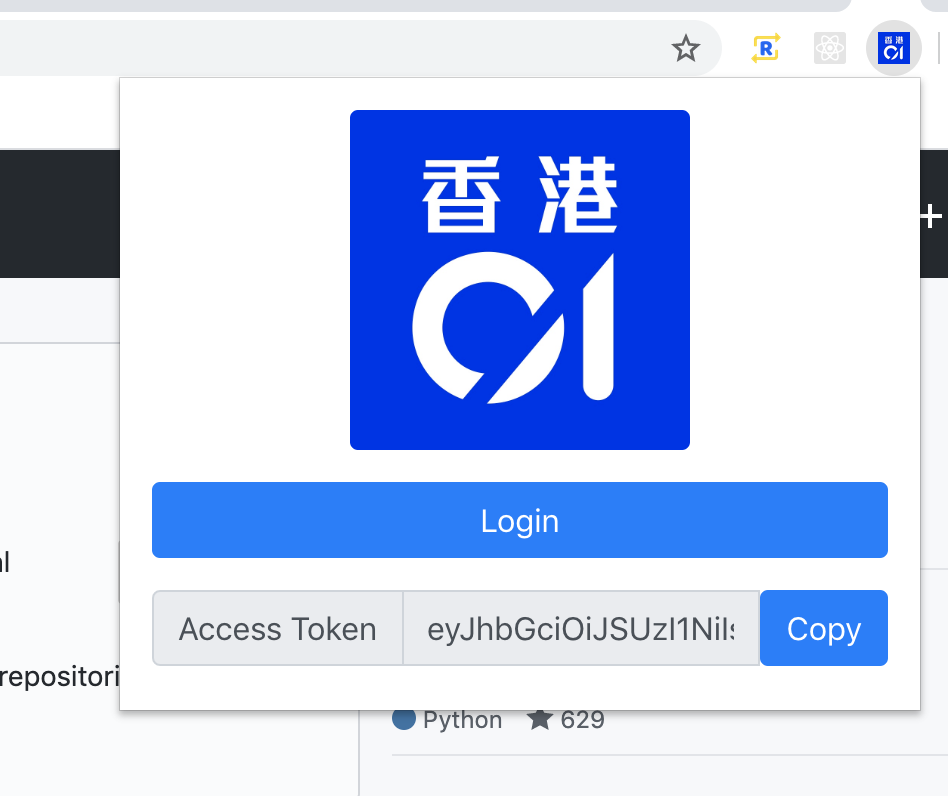

# An Extension for Lazy Developers who develop media-api-gateway

Tired to copy access token from console for testing API in Postman

I can't remember the function for getting the token

And annoyed for removing the fucking `"` at the end of the token copied

## Install

### 0. Clone this

Variables in `.env` can be found in the `media-cms` repo

```sh
yarn
yarn build
```

If edited `.env`, then run the build script above to update the build and reload the extension

### 1. Open extension Menu



### 2. Load the Extension



Enable Developer mode (Top Right Corner)

Click `Load the Unpacked Extension` (Top Left Corner)

Load `./build` and see `Token App` with 01 logo

### 3. Open the Popup by Clicking Extension Icon



`Login` will lead you to login `REACT_APP_AUTH01_CALLBACK`

the token will be updated automatically

then use the `Copy` button to copy the access token

### 4. Happy Valentine's Day

:cry: